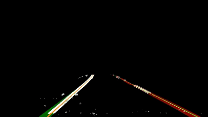

*`standard - imp` 目录下是更好（通过Udacity考核）的实现，该目录下的代码改自网络，用于学习和参考*

*code 中的README解释了详细实现*

---

# 概览（当前已完成）

[P5-车辆目标检测](#p5)

[P4-增强车道线检测](#p4)

[P3-行为克隆](#p3)

[P2-交通标识符分类器](#p2)

[P1-车道线检测](#p1)

*若图片/视频未显示，请在`demo-pic`中查看*

## P5 车辆目标检测(待完善)

`p5-vehicle-detection`：

| 更好的实现                                             | 当前待完善                                             | YOLO |
| ------------------------------------------------- | ------------------------------------------------- | ---- |
|  |  | 待实现  |

## P4 增强车道线检测

`p4-advanced-lane-finding` ：

## P3 行为克隆

`p3-behavior-cloning` ：

## P2 交通标识符分类器

`p2-traffic-sign-classifier` ：（项目效果图待上传）

## P1 车道线检测

`p1-finding-lane-line` ：

